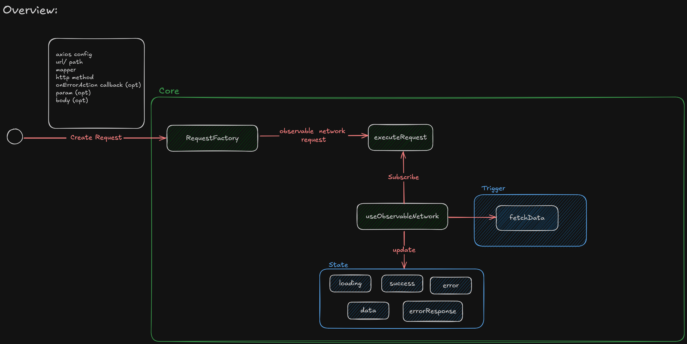
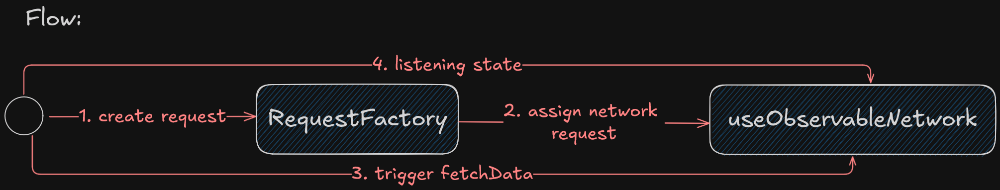

# React Observable Network Helper

**Problem:** In React applications, managing state for each network request can become repetitive and inefficient. For every single network request, the developer must create a new state to track loading, success, or failure, leading to redundant code. This repetitive process complicates the application as the number of requests grows, making it harder to maintain and scale.

**Challange:** Find efficient way to manage state for a network requests without have a redundant code to manage the state.

**Proposed Solution**: Introducing a React Observable Network Helper – a simple approach to manage network requests in React. This helper listens and emits state changes (loading, success, failure) for each network request, eliminating the need to create redundant states every time. By centralizing state management for network requests, this solution simplifies the network request code and reduces repetition.

**Overview:**



**Flow:**



## Usage

### Importing Package

```typescript
import {
  HttpMethod,
  RequestFactory,
  useObservableHttpClient,
} from "react-observable-network-helper";
```

### Creating Request

#### 1. Create Axios Config

```typescript
import { AxiosRequestConfig } from "axios";

export const axiosConfig: AxiosRequestConfig = {
  baseURL: "https://example.com",
};
```

#### 2. Create Model and Mapper

```typescript
export type PostModel = {
  userId: number;
  id: number;
  title: string;
  body: string;
};

export const mapToPostModel = (item: any): PostModel[] =>
  item.map((item: any) => ({
    userId: item.userId,
    id: item.id,
    title: item.title,
    body: item.body,
  }));
```

#### 3. Create RequestFactory

```typescript
const requestGetPost = RequestFactory<PostModel[]>({
  url: "/posts",
  mapper: (data) => mapToPostModel(data),
  httpMethod: HttpMethod.GET,
  config: axiosConfig,
  onErrorAction: (err) => {
    console.error(err);
  },
});
```

### Using Request in React Component

```typescript
const postRequest = useObservableHttpClient(requestGetPost);
```

### Example Component

Here's a simple example of how to use the reqyests in a React component:

```tsx
function App() {
  const postRequest = useObservableHttpClient(requestGetPost);

  return (
    <>
      <div>
        <button onClick={() => postRequest.fetchData()}>fetch api post</button>
      </div>

      <div>
        {postRequest.loading  && <div>loading...</div>}
        {postRequest.error  && <div>{postRequest.errorResponse?.message</div>}
        {postRequest.success && postRequest.data && postRequest.data.map((item) => (
          <div key={item.id}>
            <h3>{item.title}</h3>
            <p>{item.body}</p>
          </div>
        ))}
      </div>
    </>
  );
}

```

For the full code example you can go into the example directory


I'm very happy to hear your feedback! Have a good day!
